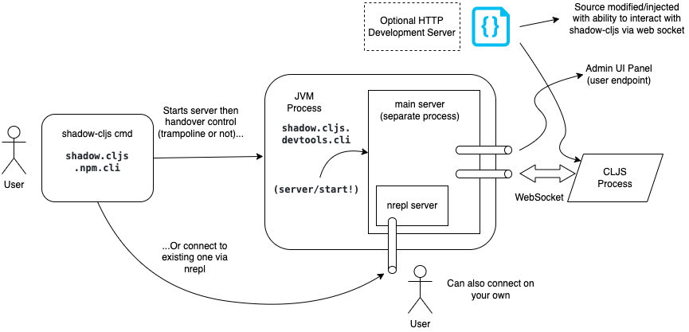

# Unpeeling Clojurescript Tooling - Shadow-cljs

## Introduction

Clojurescript Tooling have been a complicated beast to me for many years. After carefully warding through piles of doc, I *think* I'm grasping it a bit better.

Clojurescript Tooling itself, already a layer in the complex *Software Stack* used for modern development, **further consists of multiple layers**. To further complicate stuff, the situation is actually a *bifurcated stack* because sometimes you just want to do a certain layer in a completely different way. The thing you gain from it is the ability to completely customize stuff to a point that is satisfying for you. That's one of the reason using `shadow-cljs` can sometimes feel like magical.

- Layer -1: Google Closure Compiler (*not* cljs specific)
- Layer 0: Official Clojurescript Compiler
- Layer 1' (we are here): High level tooling
- Layer 2: Toolings integrator

(The bifurcation refers to layer 1' diverging from the official layer 1: Official Clojurescript high level tooling)

## Value Proposition of shadow-cljs

The list on official doc is long and overwhelming, even if it is impressive. After using it on practise projects, I think the most memorable advantages boil down to these:

- Hot Code Reload (Hot Module Reload in JS world)
- Live REPL support
- Direct, native access to JS ecosystem

The following are *features*, but not considered its core competency as they are relatively simple to implement (hopefully) and doesn't require advanced, innovative technology:

- Watching filesystem and automatic recompilation
- Development Server (w/o advanced tooling support)

Mostly, they provide comfort and convinience, while the core competencies fundamentally improve the Developer Experience.

## Incremental Understanding

The official docs of `shadow-cljs` is comprehensive and it is highly recommended to eventually read through the whole docs in depth. But that can be intimidating. So let's re-org it and presents in rounds of tidbits.

## Physical Architecture and Components

The Software itself ship as two components:

- The core/actual software, which is mostly a Clojure library (packaged as a `jar`, something that you can include as `lein` dependency, include a bunch of `defn` you can call in your own code, etc).
- The `shadow-cljs` command line tool, that you install through `npm`. It is a bunch of clojurescript code compiled into javascript `dist.js`, so you are doing `node dist.js <arg>` underneath.

In the usual development workflow, `shadow-cljs` is run in "Server mode". This can be complicated, so a picture may be in order:



There's also ability to run it in a one-off manner. This is for tasks such as `compile` when you want to do a production build.

It might be useful to further note that:

- The main server (and the JVM process hosting it) is meant to be persistent/long-running. As Clojure have the well known startup time problem, this is particularly important to minimze latency for a smooth user experience.
 - The `shadow-cljs` command line tool is smart: if you have multiple terminal invocation of it, the first one will start a server, but the rest will only connect to the server.
- Connecting to [nrepl](https://nrepl.org/nrepl/0.9/index.html) externally can be useful for say IDE integration.
- You are responsible for running the cljs process yourself - `shadow-cljs` won't do it for you! Forgetting this is a common newbie reason for encountering error when trying to start a REPL - they are generally more accurately thought of as a *remote* REPL.
 - In case of a frontend app, you should load the page in your browser.
 - In case of a node app, you should do `node <your script output>` in terminal.
- The development HTTP server is just a generic HTTP server that, well, serves static assets on some directory. You can use your own one (e.g. `npx http-server`) without loss.
- `shadow-cljs` will autodetect your project configuration to decide whether to start the JVM process using `lein`, the official `clj`, or even standalone by calling `java` and supplying all those arguments (e.g. classpaths) directly.
 - (TODO) Need for special nrepl middleware

## Mechanism of Feature

The basic principles are simple: we want to establish two-way communication between the `shadow-cljs` server, and the running CLJS process. To this end a kind of a tunneling-like solution is used: As the server are going to have to bind to an address and port, we reprogram the CLJS process to connect to it and request a web socket connection. Web Socket is choosen because it is a web/html standard and also work in the node runtime, and because it allows bidirectional comm.

Then, for hot reload: server send the new code to the CLJS process, and the process should load/execute it on the fly.

For REPL, the situation is similar: send code to the CLJS process, it should eval it, then send back the result to the server.

For the case of REPL, in the usual use case it is initiated by an end user connecting via an nrepl to the main server. So the server act as kind of like a proxy/middleman, passing messages between user and the CLJS process.

With the low level stuff out of the way, here's a few words from the author himself:

> Basically you can split the work required to perform a ClojureScript build into 4 stages:
> 
> 1. Basic Setup which just sets up the environment for later stages, applies configuration and so on.
> 2. Compile ClojureScript to JavaScript one namespace at a time
> 3. Organize the output
> 4. Optimize the output (optional)
> 
> `shadow-cljs` replaces Steps 1,3,4. Step 2 remains mostly unchanged and only changes things when there is no “official” API to hook into a particular step (eg. `npm` namespace aliasing). The very large majority of the code in `shadow-cljs` actually deals with Step 3,4 which has nothing to do with ClojureScript anymore since at this point only JS code exists and no more CLJS compilation happens.

and (for Step 2)

> This is done by `cljs.analyzer` and `cljs.compiler`. It involves reading the `.cljs` source one form at a time using `tools.reader`, analyzing it, expanding macros in the process and then generating the proper JavaScript (with proper source maps).

(From [What shadow-cljs is and isn't](https://code.thheller.com/blog/shadow-cljs/2019/03/01/what-shadow-cljs-is-and-isnt.html) - I do recommend reading his article in full, and also the rest of his blog. You may need to read it for several pass and think yourself before it all make sense though due to the inherent difficulty of this topic.)

## Usage

Basic pattern for the command line:

`shadow-cljs <action> <build target id>`

Example:

`shadow-cljs watch app`

Other actions include `compile`, various repl commands, `server`, etc.

For embedded usage, or using it by calling the function yourself inside your Clojure process, the main namespace to look for are:

- `shadow.cljs.devtools.cli` and `shadow.cljs.devtools.server`: they are invoked in the standard workflow of using the command line
- `shadow.cljs.devtools.api`: to directly control `shadow-cljs`

For instance, as the command line ends up calling the main method in the namespace `shadow.cljs.devtools.cli`, you can do that manually:

`lein run -m shadow.cljs.devtools.cli compile build-id`

For using the REPL, the most general/flexible way is to start with a base **clojure** repl. Inside it you are able to both control `shadow-cljs` itself (e.g. asks it to `watch` a directory, start a server, `compile` source code, etc), as well as to further drop into clojurescript repl.

The following types of repls are available:

- `clj-repl`: the base repl
- `node-repl`: General purpose repl running in `node`
- `browser-repl`: General purpose repl running in browser
- `cljs-repl`: Build/target specific repl (see next section)

For convinience, the namespace `shadow.cljs.devtools.api` is already aliased to `shadow` in the base repl. The functions there also mostly map 1-1 to command line actions. One major exception is `cljs-repl` on cli, which maps to `repl` in the namespace.

An example showing how to start a base repl, watch the directory, then drop into the build's repl (assuming you configured a target key'ed as `:app`):

```
$ shadow-cljs clj-repl
...
shadow-cljs - REPL - see (help), :repl/quit to exit
[1:0]~shadow.user=> (shadow/watch :app)
[:app] Configuring build.
[:app] Compiling ...
[:app] Build completed. (202 files, 1 compiled, 0 warnings, 4.61s)
[1:0]~shadow.user=> (shadow/repl :app)
[1:1]~cljs.user=>
... do development here...
[1:1]~cljs.user=> :repl/quit
nil
[1:0]~shadow.user=> :repl/quit

$
```


## Configuration

The config is stored in a file named `shadow-cljs.edn` at the root of your project. It can roughly be thought of as consisting of two parts:

- The top level configs: for things that are "global", like configs for the various "servers" started while using shadow-cljs, source paths and dependencies.
- Build configuration: it "should be a map of builds *keyed* by build ID". In other words, having multiple builds in one project is supported. This can be useful in for instance a frontend web app with SSR (Server Side Render) feature, which would be implemented as a node server.

In short, the general formats is:

```clojure
{:dependencies [[some-library "1.2.1"] ...]
 :source-paths ["src"]
 ; ... further top level configs
 :builds {:web   {:target :browser
                  ; ... build configs }
          :ssr   {:target :node-scripts
                  ; ... build configs }
          :tests {:target :karma
                  ; ... build configs }
          ; ... additional builds
         }
}
```

The details of the build configs can be tedious, as there are multiple targets and the exact details changes. (See chapter 7 to 12) However, generally speaking, some noteable ones are:

- `:target` (required): The platform the generated code should run on. Examples include `:browser`, `:karma`, `:node-library` and `:node-script`, as well as the more recent `:npm-module`.
- `:output-dir`: where to put to compiled files.
- `:asset-path`: (In browser env) The relative path from web server’s root to the resources in `:output-dir`. Obviously (or not?) this is required as the cljs may need to further load other modules by making a HTTP request over an URL, for instance.
- `:modules` (required): Specify the modules explicitly for code-splitting
- `:devtools`: Settings for development support. Notable sub-options:
 - `:watch-dir` and related (which dir to watch for file changes)
 - `:after-load` and `:before-load` and their async variant: supports for the [reloaded workflow](https://cognitect.com/blog/2013/06/04/clojure-workflow-reloaded).

## Modules, Code-splitting, and Dynamic loading

[Code-splitting](https://developer.mozilla.org/en-US/docs/Glossary/Code_splitting) is an advanced feature in the Javascript bundling scene that can be useful in some cases. The classical example is a large SPA webapp - user will need to wait for the whole bundle (as a single JS file in production build!) to be downloaded, which can be frustrating on slow internet connection. Code-splitting helps by *splitting* what was bundled into one file into multiple modules/files instead. This allows the time to initial interactivity to decrease as not all code need to be loaded for basic functions - they can be further loaded *while* user is using the app.

Different Tools take different approach to this. `shadow-cljs` takes an explicit approach: you should use your domain knowledge of the app you're writing to manually define the splitting in a way that make senses at the application level.

Again, the exact options differ between targets, but each module will be key'ed, and their inter-dependencies should be specified by you:

```clojure
{:base  {:depends-on #{} 
         ; ... other conf}
 :login {:depends-on #{:base} 
         ; ... other conf}
 :admin {:depends-on #{:base} 
         ; ... other conf}
 ; ... other modules
}
```

Some example of options in different targets: `:init-fn`, `:entries`, `:exports`...

While standard practise in modern Javascript is to use modern `import` and let the bundler handle it, sometimes you do need to *dynamically* load code yourself. One example is Icons in some UI library. `shadow-cljs` provide functions to do this:

(In browser env)

- First enable it by adding `:module-loader true` to the build config.
- Then in your code:

```clojure
(ns my.app
  (:require [shadow.loader :as loader]))

(-> (loader/load "extra")
    (.then fn-to-call-on-load fn-to-call-on-error))
```

(Check the doc for more api's. Similar feature also avialble for target `:npm-modules` under a different api - see Ch 8.3)

You can also use the standard ClojureScript `cljs.loader` API. ([Doc](https://clojurescript.org/news/2017-07-10-code-splitting))

## Javascript ecosystem integration

You can *just* use libraries from JS ecosystem:

- Install them like you would a normal JS project via `npm install <package name>`.
- Lookup the correct syntax to use corresponding to the ES6 import syntax you'd normally use at [Ch 13.1.1](https://shadow-cljs.github.io/docs/UsersGuide.html#_using_npm_packages). Example (one among many):

```javascript
import { export1 , export2 } from "module-name";
```

```clojure
(:require ["module-name" :refer (export1 export2)])
```

- (Optional due to Convention over Configuration): If wanted, change the provider. For browser, the default one is `:shadow`, which only does `:simple` optimization in the Google Closure Compiler. This is the case because, while we ideally would want `:advanced`, many packages in the general JS ecosystem would fail with this.

```clojure
{...
 :builds
 {:app
  {:target :browser
   ...
   :js-options {:js-provider :closure}
   }}}
```

### How it works

Again, citing the author's blog:

> It interfaces directly with `cljs.analyzer` and `cljs.compiler` and does some minor modifications since there are no “official” hooks into the namespace aliasing required for `npm` dependencies and such. Compilation of actual CLJS is unchanged and only the parts that involve interop with `npm` are changed. I’m very careful about introducing new stuff and want to remain 100% compatible, any new features are opt-in and have “fallbacks”.
> 
> Unfortunately the support for `:npm-deps` in CLJS is rather unreliable **so sometimes people mistakenly think that `(:require ["foo/bar" :as x])` is something shadow-cljs specific when it is absolutely not.** (Emphasis added) Strings were added since there are certain JS requires that cannot be expressed as a symbol properly.

(TODO: trace source code? And then illustrate with actual example. Should cover the custom alias and show the compiled JS code)

## Odds and Ends
:compiler-options {:infer-externs :auto}

## Conclusion

Despite the apparent simplicity, `shadow-cljs` is actually a highly sophisticated tool that does lots of inference/detection/auto-config for you. Because of this, it may be inevitable for me to make technical mistake while trying to explain its concept and usage in a way that is hopely more digestable.

My recommendation would be: just use it! Because of how clever it is, usually you find that the setup/config/development is relatively "easy". (No, you definitely are not supposed to memorize every single config option - it's more like "Convention over configuration" here) Start with something barebone, then incrementally add in the options that you have a concrete need for.

## Reference

- The official shadow-cljs user guide: https://shadow-cljs.github.io/docs/UsersGuide.html
- The author's blog: https://code.thheller.com/

